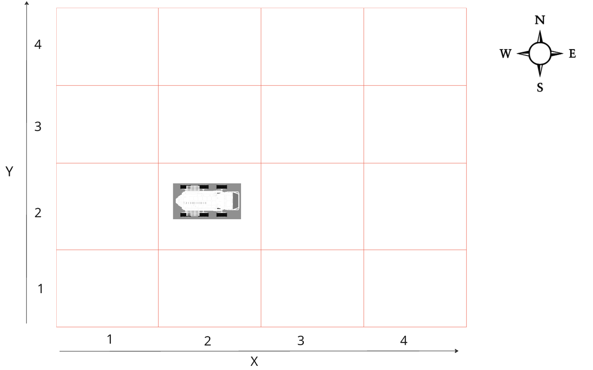

# Mars Rover Kata

- [Kata description](http://kata-log.rocks/mars-rover-kata)
- [Miro board](https://miro.com/app/board/uXjVIJcMZJ4=/)

## Description
You’re part of the team that explores Mars by sending remotely controlled vehicles to the surface of the planet. Develop an API that translates the commands sent from earth to instructions that are understood by the rover.
The rover is located on a grid at starting coordinates (x,y) and facing a direction (N,S,E,W)
It receives a sequence of commands (a string of characters) which are codified in the following way:
- When it receives F, it moves forward one position in the direction it is facing
- When it receives B, it moves backward one position in the direction it is facing
- When it receives L, it turns left changing the direction it is facing
- When it receives R, it turns right changing the direction it is facing

## TDD Rules
- Write just enough test to fail
- Write just enough prod code to pass
- Refactor only when tests are green and until we're happy to move on to next behavior
